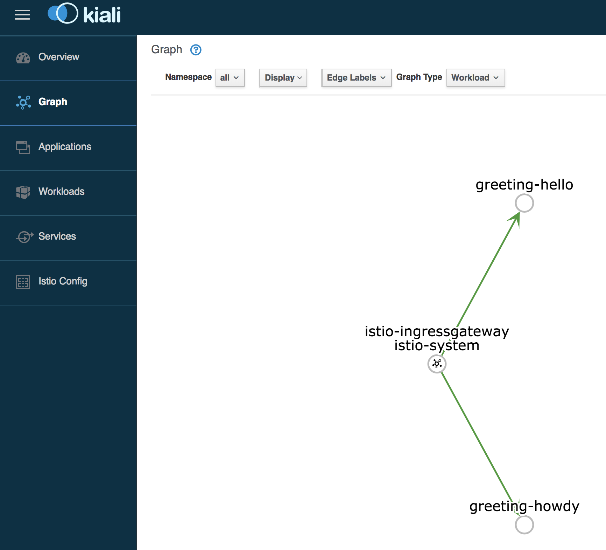
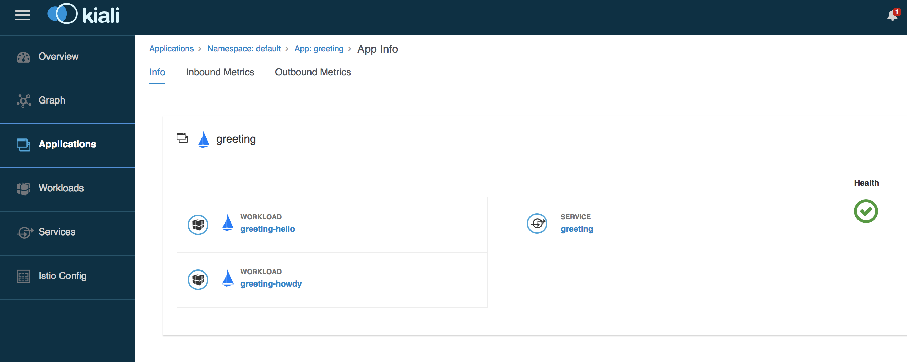

= Chapter 5: Service Mesh and Istio

== 5.1 Introduction to Service Mesh and Istio

**Slides**

. What is service mesh?
. What is Istio?
. Istio core features

== 5.2 Install Istio on Amazon EKS

More details at https://aws.amazon.com/blogs/opensource/getting-started-istio-eks/[Getting Started with Istio on Amazon EKS].

**Code**

. Download Istio:

	export ISTIO_VERSION=1.0.5
	curl -L https://git.io/getLatestIstio | sh -
	cd istio-1.0.5

. Include `istio-1.*/bin` directory in `PATH`

	export PATH=`pwd`/bin:$PATH

. Helm has already been installed in a previous chapter. Install Istio on Amazon EKS:

	helm install \
		--wait \
		--name istio \
		--namespace istio-system \
		install/kubernetes/helm/istio

. Verify the list of pods:

	kubectl get pods -n istio-system
	NAME                                     READY   STATUS    RESTARTS   AGE
	istio-citadel-7dd558dcf-68lss            1/1     Running   0          1m
	istio-egressgateway-88887488d-pptdr      1/1     Running   0          1m
	istio-galley-787758f7b8-hvsgw            1/1     Running   0          1m
	istio-ingressgateway-58c77897cc-znscr    1/1     Running   0          1m
	istio-pilot-868cdfb5f7-r8wbr             2/2     Running   0          1m
	istio-policy-56c4579578-4n6rn            2/2     Running   0          1m
	istio-sidecar-injector-d7f98d9cb-9r4jl   1/1     Running   0          1m
	istio-telemetry-7fb48dc68b-4nxq2         2/2     Running   0          1m
	prometheus-76db5fddd5-6vf7w              1/1     Running   0          1m

== 5.3 Deploy Application with Two Deployments

**Code**

. Enable `default` namespace injection:

	kubectl label namespace default istio-injection=enabled

. Talk about `istioctl` in case `default` namespace injection cannot be enabled:

	kubectl apply -f $(istioctl kube-inject -f manifest.yaml)

. Change to `manifests/charts` directory
. Deploy application with two versions of `greeting` pod, one that returns `Hello` and another that returns `Howdy`:

  helm delete myapp --purge
  helm install --name myapp myapp-hello-howdy
+
Note, there is no `type: LoadBalancer` in this case. The service will be exposed using Istio Ingress gateway so that Istio can do the traffic split.
+
. Check there are two deployments:

	kubectl get deployments
	NAME             DESIRED   CURRENT   UP-TO-DATE   AVAILABLE   AGE
	greeting-hello   1         1         1            1           31s
	greeting-howdy   1         1         1            1           31s

. Check pods for each deployment and note that it has two containers (one for the application and one for the sidecar):

	kubectl get pods
	NAME                              READY   STATUS    RESTARTS   AGE
	greeting-hello-6799458d68-z7skl   2/2     Running   0          32s
	greeting-howdy-f547698d6-gwjx9    2/2     Running   0          32s

. Get list of containers in the pod:

	kubectl get pods \
		-l greeting=hello \
		-o jsonpath={.items[*].spec.containers[*].name}
	greeting istio-proxy

Same Java application, now two different versions deployed to a Kubernetes cluster.

== 5.4 Create Istio Resources

**Slides**

- DestinationRule
- VirtualService
- Gateway

**Code**

. Create Istio resources ingress `Gateway`, `VirtualService` and `DestinationRule`:

	kubectl apply -f standalone/greeting-istio.yaml

. Check created manfiests:

	kubectl get virtualservice,destinationrule,gateway

. Get the ingress gateway address:

	export INGRESS_HOST=$(kubectl -n istio-system get service istio-ingressgateway -o jsonpath='{.status.loadBalancer.ingress[0].hostname}')
	export INGRESS_PORT=$(kubectl -n istio-system get service istio-ingressgateway -o jsonpath='{.spec.ports[?(@.name=="http2")].port}')

. Access application multipe times to see about 50% split between two responses:

  for i in {1..10}
  do
    curl -q -H"Host: greeting.com" http://$INGRESS_HOST:$INGRESS_PORT/hello
    echo
  done

== 5.5 Traffic Shifting using Istio

**Code**

. Update `weight` attribute of `VirtualService` to split traffic between 90% to `Hello` and 10% to `Howdy` version of the `greeting` service.

	kubectl apply -f standalone/greeting-istio.yaml

. Invoke the service again to see the traffic split between two services:

  for i in {1..50}
  do
    curl -q -H"Host: greeting.com" http://$INGRESS_HOST:$INGRESS_PORT/hello
    echo
  done

Same Java application, now traffic splitting 90% to Hello version and 10% to Howdy version. Both are deployed to the same Kubernetes cluster.

== 5.6 Visualize Mesh using Kiali

https://www.kiali.io/[Kiali] is yet another Greek word meaning monocular or spyglass. Kiali project provides answers to the questions: What microservices are part of my Istio service mesh and how are they connected?

**Code**

. By default, Kiali is disabled and needs to be enabled. Enable Kiali and apply the changes:

	helm template --set kiali.enabled=true install/kubernetes/helm/istio --name istio --namespace istio-system > $HOME/istio.yaml
	kubectl apply -f $HOME/istio.yaml

. Verify:

	kubectl get pods -n istio-system -l app=kiali
	NAME                     READY   STATUS    RESTARTS   AGE
	kiali-58bf795c96-pdf9b   1/1     Running   0          32s

. Open Kiali UI:

	kubectl -n istio-system \
      port-forward $(kubectl -n istio-system \
      get pod -l app=kiali \
      -o jsonpath='{.items[0].metadata.name}') 20001:20001 &

. View Kiali dashboard http://localhost:20001/
. Invoke the endpoint a few times:

	for i in {1..50}
	do
      curl -q -H"Host: greeting.com" http://$INGRESS_HOST:$INGRESS_PORT/hello
      echo
	done

. Show Kiali dashboard:
+
image::images/kiali-dashboard.png[]
+
Click on `Graph`, choose `Workload` to see a dynamic graph:
+

+
Click on `Applications`, `greeting` to see details about the application:
+

+
. `Ctrl` + `C` to terminate the port forwarding
. Remove Istio resources:

	kubectl apply -f manifests/standalone/greeting-istio.yaml

. Remove Istio

	helm delete istio --purge
	kubectl delete -f install/kubernetes/helm/istio/templates/crds.yaml -n istio-system

